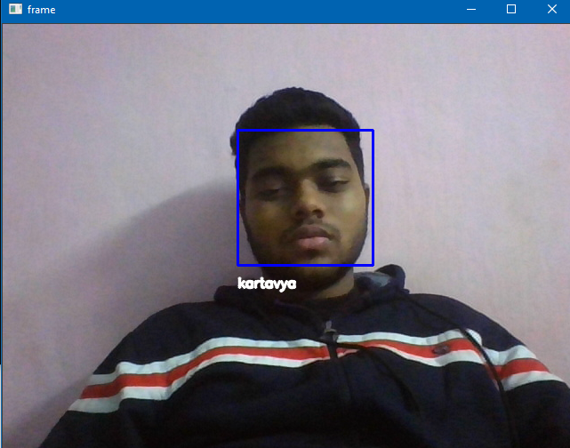

# Face-Recognition
OpenCV Face Recognition

An image recognition model which works by detecting faces using haar_cascades and then recognizes them using LBPH algorithm (provided in opencv-contrib-python library)

Put all the face images you want your model to recognize in the `images` folder in the format as shown there.

### Install the dependencies

`pip install -r requirements.txt`

### Train your model and save train data
`python faces-train.py`

### Test your model against live webcam
`python faces.py`

### Output

